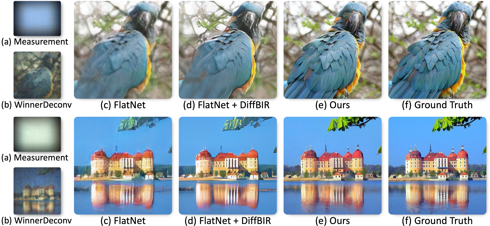
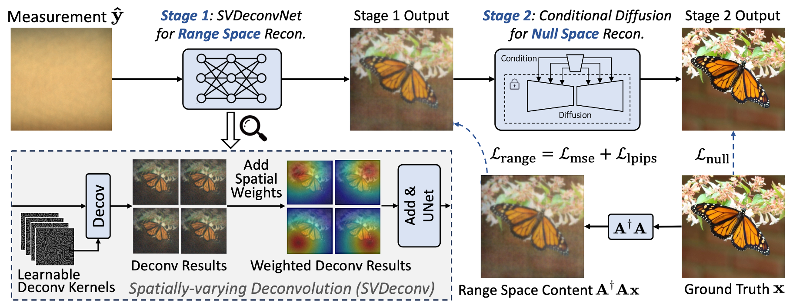

# PhocoLens: Photorealistic and Consistent Reconstruction in Lensless Imaging

[](LICENSE)
[](https://arxiv.org/abs/2409.17996)
[](https://phocolens.github.io/)




Official PyTorch implementation of the NeurIPS 2024 paper "PhocoLens: Photorealistic and Consistent Reconstruction in Lensless Imaging"

## 📌 Table of Contents
- [Introduction](#-introduction)
- [Method Overview](#-method-overview)
- [Getting Started](#-getting-started)
  - [Prerequisites](#prerequisites)
  - [Installation](#installation)
- [Data Preparation](#-data-preparation)
- [Training](#-training)
  - [Stage 1: Range Space Reconstruction (SVDeconv)](#stage-1-range-space-reconstruction-svdeconv)
  - [Stage 2: Null Space Recovery (NullSpaceDiff)](#stage-2-null-space-recovery-nullspacediff)
- [Inference](#-inference)
- [Results](#-results)
- [Citation](#-citation)
- [License](#-license)

## 🌟 Introduction

Lensless imaging systems offer advantages in size, cost, and field-of-view, but typically produce low-quality images. PhocoLens addresses this by decomposing the reconstruction problem into two domains: the range space (measured signals) and null space (lost information). Our approach delivers photorealistic reconstructions with unprecedented quality for lensless imaging.

## 🔍 Method Overview

PhocoLens employs a novel two-stage reconstruction pipeline:

1. **Range-Null Space Decomposition**: We mathematically divide the reconstruction problem into recoverable (range space) and lost (null space) information.

2. **Spatially-Varying Deconvolution Network (SVDeconv)**: Our first stage recovers high-fidelity content from the range space using a specialized deconvolution network.

3. **Null Space Content Recovery (NullSpaceDiff)**: The second stage uses conditional diffusion models to recover lost details while maintaining consistency with first-stage output.



## 🚀 Getting Started

### Prerequisites

- NVIDIA GPU with at least 12GB VRAM (24GB recommended for training)
- CUDA 11.7+
- Python 3.9+
- PyTorch 1.13+

### Installation

```bash
# Clone the repository
git clone https://github.com/yourusername/PhoCoLens.git
cd PhoCoLens

# Create conda environment
conda create -n phocolens python=3.9
conda activate phocolens

# Install core dependencies
pip install -r requirements.txt

```

## 📥 Data Preparation

PhocoLens supports two lensless imaging datasets:

1. **PhlatCam**: [Download Page](https://siddiquesalman.github.io/flatnet/)
2. **DiffuserCam**: [Download Page](https://waller-lab.github.io/LenslessLearning/dataset.html)

<!-- You can download them automatically:

```bash
./scripts/download_data.sh
``` -->

Expected directory structure:

```
phocolens
├── data
│   ├── phlatcam
│   │   ├── orig
│   │   ├── phase_psf
│   │   ├── text_files
│   │   └── imagenet_caps_384_12bit_Feb_19
│   └── diffusercam
│       ├── psf.tiff
│       ├── dataset_train.csv
│       ├── dataset_test.csv
│       ├── diffuser_images
│       └── ground_truth_lensed
```

### Preparing PhlatCam Dataset

```bash

# Copy ground truth data
python tools/copy_gt.py


```

## 🏋️ Training

### Stage 1: Range Space Reconstruction (SVDeconv)

Navigate to the SVDeconv directory:

```bash
cd SVDeconv

# Create soft links to data
ln -s ../data data


# Generate range space data for training
python tools/decode_and_sim_rgb.py --psf_path data/phlatcam/phase_psf/psf.npy \
    --obj_path data/phlatcam/flatnet/train/gts \
    --save_path data/phlatcam/train/decoded_sim_captures

# Generate range space data for validation
python tools/decode_and_sim_rgb.py --psf_path data/phlatcam/phase_psf/psf.npy \
    --obj_path data/phlatcam/train/gts \
    --save_path data/phlatcam/val/decoded_sim_captures
```

#### Single-GPU Training

```bash
# Train with default configuration
python train.py with ours_meas_1280_1408_decoded_sim_svd -p
```

#### Multi-GPU Training

```bash
# Train with 8 GPUs
python -m torch.distributed.launch --nproc_per_node=8 --use_env \
    train.py with ours_meas_1280_1408_decoded_sim_svd distdataparallel=True -p
```

You can modify training parameters in `config.py`.

### Process Intermediate Results

After Stage 1 training, generate inputs for Stage 2:

```bash
python val.py with ours_meas_1280_1408_decoded_sim_svd -p
cd ..
python tools/data_process.py
```

### Stage 2: Null Space Recovery (NullSpaceDiff)

```bash
cd NullSpaceDiff
```

Download the StableSR pre-trained model to the `ckpts` folder first.

```bash
# Multi-GPU Training
python main.py --train \
    --base configs/NullSpaceDiff/phlatcam_decoded_sim_multi_T_512.yaml \
    --gpus 0,1,2,3,4,5,6,7, \
    --name svd_nullspace_diff
```

## 🧪 Inference

### Stage 1 (SVDeconv)

```bash
cd SVDeconv
python val.py with ours_meas_1280_1408_decoded_sim_svd -p
```

### Stage 2 (NullSpaceDiff)

```bash
cd NullSpaceDiff
python ./scripts/sr_val_ddpm_lensless.py \
    --init-img path/to/stage1/output \
    --outdir path/to/save/results \
    --ckpt path/to/trained/model \
    --n_samples 5 \
    --ddpm_steps 200
```


## 📜 Citation

If you find our work useful in your research, please consider citing:

```bibtex
@article{cai2024phocolens,
  title={Phocolens: Photorealistic and consistent reconstruction in lensless imaging},
  author={Cai, Xin and You, Zhiyuan and Zhang, Hailong and Gu, Jinwei and Liu, Wentao and Xue, Tianfan},
  journal={Advances in Neural Information Processing Systems},
  volume={37},
  pages={12219--12242},
  year={2024}
}
```

## 📄 License

This project is licensed under the MIT License - see the [LICENSE](LICENSE) file for details.
